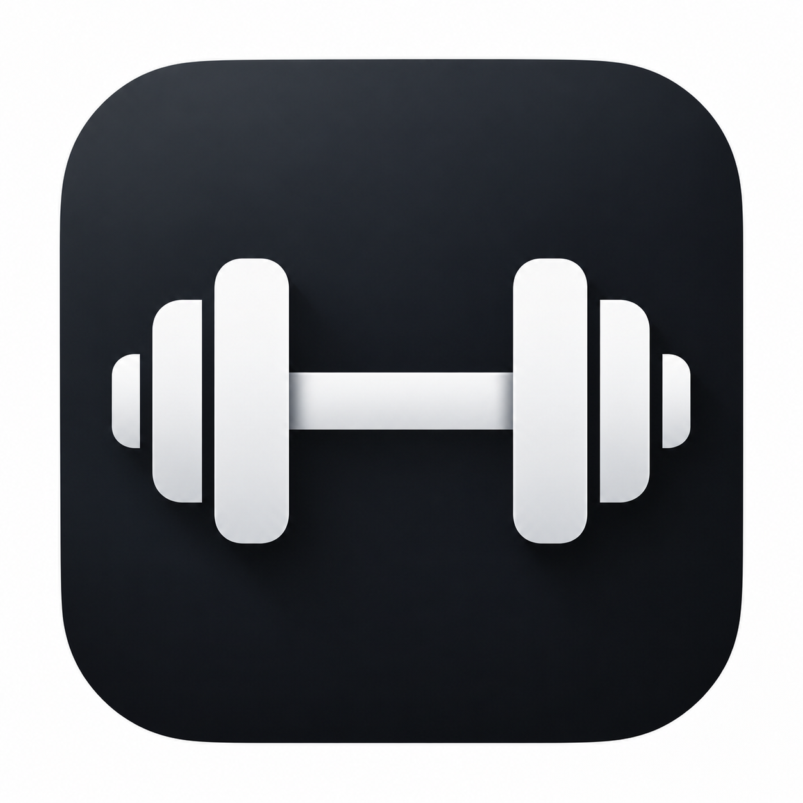
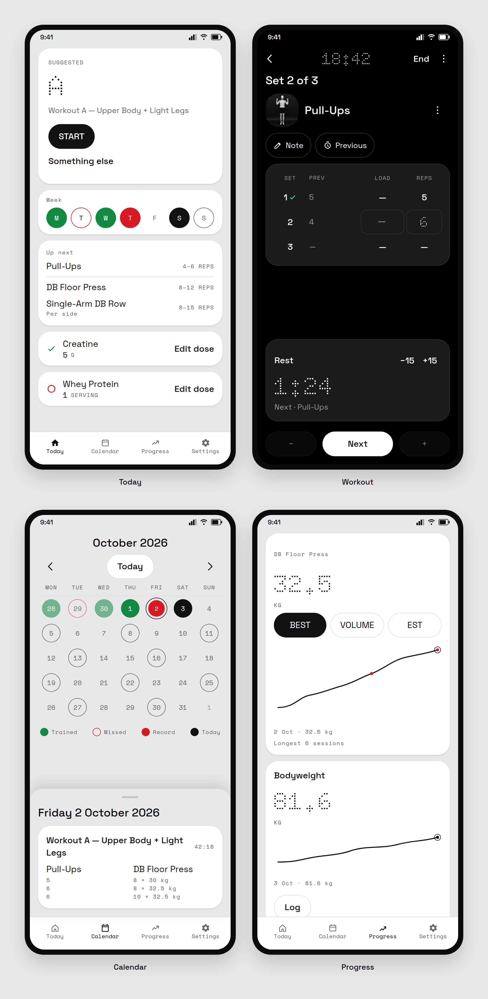
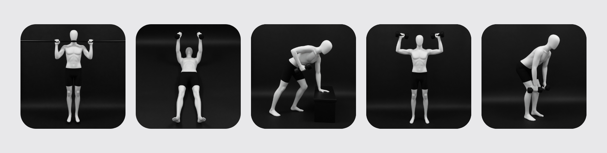

<p align="center">
  
</p>

<h1 align="center">Gains</h1>

<p align="center">
  A workout log for one person, on one Android phone.<br>
  Sessions, measurements, and supplements stay on the device.<br>
  There is no account and no cloud.
</p>

<p align="center">
  
</p>

<p align="center">
  Green is trained, taken, or done. Red is not yet, a missed day, or a personal record.<br>
  The pictures use the app’s type, colors, and layout, with a sample week filled in.
</p>

Android 8.0 and later. This is version 1.1.

## Today

Today names the workout, shows the week, and lists the next exercises. A program can rotate through workouts and rest days, or put one workout on each weekday. Supplements for the day sit on the same screen. The streak counts finished sessions.

## Workout

The workout screen stays dark. You log sets with a keypad that stays closed until Load or Reps is tapped. The previous result sits beside the load and the reps, and a logged set gets a check. Plates are for barbells.

A rest timer can ring while the screen is off. Leave the screen and the session stays. Discard is the only way to delete it.

## Calendar and progress

Calendar and Progress share the same day marks. A trained day is a green disk. A missed due day is a red ring. A personal record is red. Today, with nothing logged yet, is the inverted disk. Open a day to read the session.

Progress is one chart of best, volume, and estimated one-rep max. A record on that line is a red point. Bodyweight, measurements, and what is left of a supplement sit under the chart.

## Home screen

The widget shows today’s suggestion, the next exercise, and the week. The status words are REST, DUE, LIVE, and DONE.

## Figures

<p align="center">
  
</p>

Exercise figures are matte mannequins stored in the app. They are shown in the catalog and beside the name during a workout.

## Settings

Settings cover the theme, kilograms or pounds, the catalog, programs, supplements, reminders, bar weight, and plates. Health Connect is optional. When it is on, Gains can write a finished workout and a bodyweight entry. It does not read Health Connect.

Backup is a zip you export yourself.

Weights are stored as kilograms and lengths as centimeters, and shown in the unit you choose. Gains does not track nutrition, and it has no social feed, ads, or watch app.

## Build

Requirements: Android Studio, JDK 17, and Android SDK 37.

1. Open the project in Android Studio.
2. Sync Gradle.
3. Run the `app` configuration on a device or emulator.

A signed release uses `keystore.properties` in this directory. That file is not committed. Without it, the release task still builds, and the output is unsigned.

```bash
./gradlew :app:bundleRelease :app:assembleRelease
```

Signed files for a local release can be copied to `dist/`. That directory is gitignored. Store text for 1.1 is in [store/play-console.md](store/play-console.md).

## In the repo

- `app/` is the Android application.
- [guide/CURRENT.md](guide/CURRENT.md) is the product spec.
- Font licenses are in `app/src/main/assets/licenses/`.
